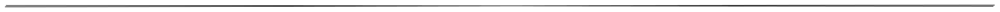

# ES2023 / ES2022 / ES2021

## ES2023의 새로운 기능


2023년 첫번째로 [ES2023](https://github.com/tc39/proposals) 에 [Finished Proposals](https://github.com/tc39/proposals/blob/main/finished-proposals.md) 로 도입된 기능을 살펴보겠습니다.


덧붙여서 Finished Proposal은 "복수의 구현이 이미 존재한다"가 전제이므로, 2023이라고 하는 이름에도 불구하고 이미 일부의 브라우저에서 사용 가능합니다. 또는 ES2023의 새로운 기능은 모든 현대 브라우저에서 이미 사용할 수 있습니다.


### Array find form last

```javascript
const array1 = [5, 12, 8, 130, 4];

console.log(array1.find(element => element > 10));     // 12
console.log(array1.findLast(element => element > 10)); // 130

console.log(array1.findIndex(element => element > 10));     // 1
console.log(array1.findLastIndex(element => element > 10)); // 3
```


Array는 [indexOf](https://developer.mozilla.org/ja/docs/Web/JavaScript/Reference/Global\_Objects/Array/indexOf) 와 [lastIndexOf](https://developer.mozilla.org/ja/docs/Web/JavaScript/Reference/Global\_Objects/Array/lastIndexOf) 로 전후 추출을 지원합니다.

그러나 [find](https://developer.mozilla.org/ja/docs/Web/JavaScript/Reference/Global\_Objects/Array/find) 와 [findIndex](https://developer.mozilla.org/ja/docs/Web/JavaScript/Reference/Global\_Objects/Array/findIndex) 에 대해서는 왜 ·· `findLast`가 `findLastIndex`없다, 라고 하는 비대칭인 상태가 되어 있었습니다.\
그래서 [findLast](https://developer.mozilla.org/ja/docs/Web/JavaScript/Reference/Global\_Objects/Array/findLast) 및 [findLastIndex](https://developer.mozilla.org/ja/docs/Web/JavaScript/Reference/Global\_Objects/Array/findLastIndex) 를 추가합니다.  이것에 의해, 후방으로부터의 검색 메소드가 갖추어지게 되었습니다.

findLast는 2022년에 [모든 브라우저에서 지원되었습니다](https://caniuse.com/?search=findLast) .


### Hashbang Grammer

파일의 첫 번째 줄에 있는 `#!`주석으로만 취급합니다.

```javascript
#! hoge -> 첫번째 줄에 있을 경우 이것은 코멘트입니다.

#! fuga -> 다음 줄에 있을 경우 이것은 구문 오류가 발생합니다.
```


쉘 스크립트의 시작 부분에는 자신이 어떤 프로그램으로 시작할지를 지정하는 [shebang ](https://ko.wikipedia.org/wiki/%EC%85%94%EB%B1%85)이라는 메커니즘이 있습니다.\
그리고 JavaScript의 서버 측 실행 환경 인 Node도 shebang을 사용할 수 있습니다 .\
그러나 JavaScript에는 이러한 문법이 존재하지 않으므로 Node와 같은 코드를 사용하면 구문 오류가 발생합니다.\
그 때문에 Node와 JavaScript에서 같은 소스를 돌릴 수 없었습니다.

그래서 자바스크립트에서도 첫 줄의 시작 부분에 있는 `#!`주석으로 취급하기로 합니다.\
코멘트 취급되는 것은 선두행의 선두만이며, 2행째 이후에 있는 경우 등은 코드 취급으로 됩니다.

브라우저에는 [2019년경에는 이미 구현되어](https://caniuse.com/?search=Hashbang) 있다고 합니다.




## ES2022 새로운 기능


&#x20;[ES2022에 Finished Proposals로서 도입된 기능](https://github.com/tc39/proposals/blob/master/finished-proposals.md) 이 각각 어떤 것인지 살펴보기로 합니다.

덧붙여서 Finished Proposal의 앞 단계인 Stage4가 「복수의 구현이 이미 존재한다」라고 하는 것이 정의이므로, 2022라고 하는 이름에도 불구하고 이미 일부의 브라우저로 사용 가능, 라고 할까 일부 이외의 브라우저로 사용 가능합니다.

## ES2022

### Class Fields

Class Fields는 비슷한 3RFC 모음입니다.

#### [Private instance methods and accessors](https://github.com/tc39/proposal-private-methods)

private 메소드입니다.  오히려 지금까지 존재하지 않았던 것에 놀랍습니다.

```javascript
class Foo{
  #privatemethod() {
    return "privatemethod";
  }
  publicmethod() {
    return "publicmethod";
  }
}

c = new Foo();
c.publicmethod(); // "publicmethod"
c.privatemethod(); // c.privatemethod is not a function
c.#privatemethod(); // Private field '#privatemethod' must be declared in an enclosing class
```

다른 언어의 private 메소드와 같고, 클래스내에서는 호출 가능합니다만, 클래스외로부터 `Foo.#privatemethod()`와 같이 액세스 할 수 없습니다.\
다른 언어보다 강력한 점으로서 리플렉션과 같은 수단을 가지고 있어도 액세스할 수 없는 완전한 private입니다.

그리고 액세서에도 붙일 수 있게 됩니다만, 이쪽은 정직 용도를 잘 모릅니다.

```javascript
class Foo{
  get #x(){return this.value;}
  set #x(value){this.value = value;}
}
```

#### [Class Public Instance Fields & Private Instance Fields](https://github.com/tc39/proposal-class-fields)

public · private 필드입니다.\
오히려 지금까지 존재하지 않았던 것에 놀랍습니다.

```javascript
class Foo{
  x = 1;
  #y = 1;
}
```

public에 대해서는, JS에서는 언제 어디서나 `foo.x = 1`public 필드를 만들 수 있으므로 궁극적으로는 필요 없다고 하면 필요하지 않습니다만, 뭐 명시할 수 있는 것이 좋네요.

반면에 private 필드는 아무리 명시하더라도 외부에서 액세스할 수 없습니다.

그런데 이 이야기가 나왔다는 것은 [상당히 전이었던 것](https://qiita.com/tsuuuuu\_san/items/025a398ca284d4b368bf) 같지만, Finished가 된 것은 올해가 드디어였어요.

#### [Static class fields and private static methods](https://github.com/tc39/proposal-static-class-features)

정적 필드 메소드입니다.\
오히려 지금까지 존재하지 않았던 것에 놀랍습니다.

```javascript
class Foo{
  static x = 1;
  static #y = 2;
  
  static bar(){}
  static #baz(){}
}
```

위에서 나온 방금의 private 필드나 private 메소드에도 대응합니다.

이 근처의 기능이 갖추어진 것에 의해, 원소의 JavaScript에서도 간신히 괜찮은 클래스 구문을 쓸 수 있게 될 것 같네요.

### [RegExp Match Indices](https://github.com/tc39/proposal-regexp-match-indices)

정규식 매칭에 매치한 위치의 정보를 추가합니다.

```javascript
const result = /ef(gh)(i)j/d.exec('abcdefghijklmn');
console.table(result.indices)
```


정규식에 플래그 `d`를 추가하면 반환 값 `indices`이 증가합니다.\
추가가 필요한 것은 퍼포먼스적인 이유이며, 플래그가 없는 경우는 지금까지와 같은 거동이 됩니다.

`indices`는 배열이 되어 있어 0에는 정규 표현 전체가 캐릭터 라인에 매치한 부분이 들어옵니다.\
예이면 4-10이지만이 반환 값은 `slice`그냥 잘라내는 값입니다.

```javascript
'abcdefghijklmn'.slice(4, 10); // 'efghij'
```

1 이후에는 캡처 그룹이 있으면 그 일치하는 범위가 들어갑니다.\
예인 경우 1 `(gh)`은 2에 `(i)`대한 캡처 그룹의 결과를 포함합니다.

이번 예에서는 실질적으로 정규 표현을 사용하지 않기 때문에 별로 의미가 없습니다만, 캡쳐 캐릭터 라인 길이가 부정이 되는 것 같은 정규 표현을 사용할 때 등은 특히 편리하게 될 것입니다.

### [Top-level await](https://github.com/tc39/proposal-top-level-await)

async 함수 외부에서 await를 사용할 수 있습니다.

```javascript
await 1;
```

이것이 가능하고 무엇이 편리한가 하면, 빨리 export하거나 할 수 있습니다.

```javascript
export const hoge = await f();
```

더 자세한 기사가 [여기에 있었](https://qiita.com/uhyo/items/0e2e9eaa30ec2ff05260) 으므로, 자세한 것은 여기 등을 보면 좋다고 생각합니다.\
무슨 말을 하는지 90% 몰랐습니다.

안돼

```javascript
function f(){
  await 1; // Uncaught SyntaxError: await is only valid in async functions
}
```

또한 async가 아닌 함수 중에서는 여전히 사용할 수 없습니다.\
왜.

### [Ergonomic brand checks for Private Fields](https://github.com/tc39/proposal-private-fields-in-in)

`人間工学に基づいたprivateフィールドのチェック`\
뭐야.

`in`private 필드에도 사용할 수 있습니다.

```javascript
class Foo{
  #privateField = 1;
  
  static isFoo(obj){
    return #privateField in obj;
  }
}

class Bar{
  #privateField = 1;
}

Foo.isFoo(new Foo()); // true
Foo.isFoo(new Bar()); // false
```

당연히 private 필드는 외부에서 보이지 않으므로 자신의 클래스 내에서만 사용할 수 있습니다.

즉, 이것과 대체로 같습니다.

```javascript
class Foo{
  #privateField = 1;
  
  static isFoo(obj){
    return obj instanceof Foo;
  }
}
```

세세한 곳에서 동작이 다른 것 같습니다만, 거기까지 해서 이 기능을 필요로 하는 이유는 잘 몰랐습니다.

2021년 7월에 열린 TC39 회의에서 [Ergonomic brand checks for Private Fields](https://github.com/tc39/proposal-private-fields-in-in) 라는 제안이 Stage 4가 되었습니다. 이 제안은 ES2022에 포함될 예정입니다. 또한 [TypeScript 4.5에도 포함될 예정입니다](https://devblogs.microsoft.com/typescript/announcing-typescript-4-5-rc/#private-field-presence-checks) .

이 기사에서는 Ergonomic brand checks for Private Fields에 대해 설명합니다.

### 개요

Ergonomic brand checks for Private Fields는 `in`연산자를 사용하여 개인 필드가 있는지 여부를 결정할 수 있는 제안서입니다.

#### 현재 `in`연산자

`in`연산자는 객체가 특정 이름의 속성을 가지고 있는지 여부를 결정하는 이항 연산자입니다. 왼쪽에 속성 이름을, 오른쪽에 객체를 받습니다.

```javascript
const obj = { prop1: 1 };
console.log("prop1" in obj); // true
```

#### 새로운 `in`연산자

Ergonomic brand checks for Private Fields에서는 이 `in`연산자를 확장하여 왼쪽에 Private Identifier를 가져올 수 있습니다.

Private Identifier 는 `#foo`같은 형태를 한 특별한 식별자로, 클래스의 프라이빗 필드를 표현하는데 사용됩니다.

예를 들어, 다음 코드에서 클래스 `Foo`에는 `#prop1`개인 필드가 있습니다. 이 때는 `#prop1`Private Identifier입니다.

```javascript
class Foo {
  #prop1;
}
```

확장된 `in`연산자에서는 다음과 같이 개체에 개인 필드가 포함되어 있는지 확인할 수 있습니다.

```javascript
#prop1 in obj
```

그러나 비공개 필드는 비공개이므로 위의 코드는 해당 필드가있는 클래스에서만 사용할 수 있습니다.

즉, 다음과 같이 클래스 밖에서 프라이빗 필드에 대해서 `in`를 사용하면 에러가 됩니다.

```javascript
class Foo {
  #prop1;
}
console.log(#prop1 in new Foo());
// Uncaught SyntaxError: Private field '#prop1' must be declared in an enclosing class
```

그러나 다음과 같은 코드는 오류가되지 않습니다. 메소드 `foo`는 클래스 `Foo`안에 있으므로, Private Identifier 인 `#foo`것을 `in`연산자의 좌변으로서 사용할 수가 있습니다. 그리고 이 `foo`안에서는 인스턴스이며, 그것에는 당연한 `this`프라이빗 프로퍼티가 존재하기 때문에 결과가 됩니다.`Foo#prop1#prop1 in thistrue`

```javascript
class Foo {
  #prop1;
  foo() {
    return #prop1 in this;
  }
}
console.log(new Foo().foo()); // true
```

### 동기 부여

존재하지 않는 비공개 필드에 액세스하면 런타임 오류가 발생합니다.

그 거동과 try / catch 를 조합해, 다음과 같이 해 오브젝트의 클래스를 판정할 수 있습니다.

```javascript
class Foo {
  #brand;
  static isFoo(obj) {
    try {
      obj.#brand;
      return true;
    } catch {
      return false;
    }
  }
}
```

`obj.#brand`에 액세스할 때 `obj`Foo의 인스턴스가 아닌 경우 런타임 오류가 발생하고 `catch`들어오기 `false`가 반환됩니다. 이 방법으로 객체가 `Foo`인스턴스인지 확인하는 정적 메서드를 만들 수 있습니다.

하지만 이 패턴은 중복입니다. `in`연산자를 사용하면 더 짧게 쓸 수 있습니다.

```javascript
class Foo {
  #brand;
  static isFoo(obj) {
    return #brand in obj;
  }
}
```

이것이 이 제안서의 주요 동기 부여입니다.

``[`instanceof`연산자](https://developer.mozilla.org/ko/docs/Web/JavaScript/Reference/Operators/instanceof) 도 기본적으로는 이 목적으로 사용할 수 있습니다. 그러나 `instanceof`연산자는 프로토타입에 따라 다르므로 프로토타입을 다시 작성하여 동작을 변경할 수 있습니다.

다음 예제에서는 `obj`는 인스턴스`Foo` 가 아니지만 나중에 프로토타입을 다시 작성하는 `obj instanceof Foo`것이 `true`아닙니다.

```javascript
class Foo {}
const foo = new Foo();
const obj = {};
Object.setPrototypeOf(obj, foo);
console.log(obj instanceof Foo); // true
```

또한 [Symbol.hasInstance](https://developer.mozilla.org/en-US/docs/Web/JavaScript/Reference/Global\_Objects/Symbol/hasInstance) 를 사용하여 `instanceof`동작을 변경할 수 있습니다.

그래서 보다 안전하게 객체의 기초가 된 클래스를 검증하고 싶은 경우는 `in`연산자를 사용하면 좋을 것입니다.

### 참고 링크

* [https://tc39.es/ecma262/#prod-RelationalExpression](https://tc39.es/ecma262/#prod-RelationalExpression)
* [https://tc39.es/ecma262/#prod-PrivateIdentifier](https://tc39.es/ecma262/#prod-PrivateIdentifier)
* [https://github.com/tc39/proposal-private-fields-in-in](https://github.com/tc39/proposal-private-fields-in-in)
* [https://developer.mozilla.org/ja/docs/Web/JavaScript/Reference/Operators/in](https://developer.mozilla.org/ja/docs/Web/JavaScript/Reference/Operators/in)


### [.at](https://github.com/tc39/proposal-relative-indexing-method)

모든 인덱스 가능한 클래스 `Array・String・TypedArray`에, 지정 위치의 값을 취득하는 메소드 `.at()`를 추가합니다.

```javascript
'abcdef'.at(0); // a
'abcdef'.at(1); // b
'abcdef'.at(-1); // f
'abcdef'.at(-2); // e

[1, 2, 3].at(0); // 1
[1, 2, 3].at(1); // 2
[1, 2, 3].at(-1); //3
```

지정된 위치의 값을 반환합니다.\
다른 언어로도 자주 있는 녀석입니다.\
불행히도 인수는 하나뿐이며, `'abcdef'.at(1, 3) // 'bcd'`같은 범위를 얻을 수 없습니다.

겉보기 `[]`와 같은 얀이라고 생각합니다만, 실은 `[]`부의 값을 사용할 수 없습니다.

```
'abcdef'[0]; // a
'abcdef'[1]; // b
'abcdef'[-1]; // undefined
```

보다는 `[]`객체의 속성에 액세스하는 것뿐입니다. 예를 들어 `foo[-1]`객체 `foo`의 속성 `-1`을 참조하는 것입니다.\
따라서 말미로부터 세고 싶은 경우는, 일일이 길이를 조사해 `foo[foo.length-1]`해야 했습니다.\
앞으로는 보통으로 쓸 수 있게 됩니다.

### [Accessible Object.prototype.hasOwnProperty](https://github.com/tc39/proposal-accessible-object-hasownproperty)

hasOwnProperty를 사용하기 쉽게 만드는 제안.

```
let object = { foo: false };
Object.prototype.hasOwnProperty.call(object, "foo");
```

빌어 먹을 긴!

그래서 쇼트 핸드입니다.

```
let object = { foo: false };
Object.hasOwn(object, "foo"); // true
```

그냥 짧은 손이므로 할 수있는 것은 동일합니다.

그런데 아마추어 시선이라면 첫 번째 예와 같은 이상한 일을하지 마십시오.

```
let object = { foo: false };
object.hasOwnProperty('foo');
```

라고 쓰면 좋다고 생각해 버립니다만, 이러한 솔직한 예는 [프로토 타입 오염](https://sosukesuzuki.dev/posts/stage-3-object-hasown/) 에 의해 죽기 때문에 안 되는 것입니다.\
그 탓에 `Object.prototype.hasOwnProperty.call`얼마나 이상한 쓰는 법을 강제당하고, 그것을 짧게 하기 위해서 `Object.hasOwn`무슨 일이 나타났다고.\
이런 일이 된 것도 모두 prototype은 녀석의 사업이다.

### [Class Static Block](https://github.com/tc39/proposal-class-static-block)

정적 초기화 블록입니다.

```
class Foo{
  static {
    console.log('static');
  }
  
  constructor(){
    console.log('constructor');
  }
}
```

`static`블록은 클래스가 정의된 시점에서 실행됩니다.\
[Java의 정적 초기화 블록](https://docs.oracle.com/javase/specs/jls/se10/html/jls-8.html#jls-8.7) 은 초기 인스턴스화 시점에서 평가되지만, 이 클래스는 더 빨리 클래스를 로드한 시점에서 평가됩니다.

인수를 전달할 수 없습니다.\
그런 타이밍도 없습니다.

유스 케이스로서는, 정적 필드의 초기치로서 평가식을 넣고 싶을 때 등 다양한 것이 생각될 것입니다.

```
class Foo{
  static #privateValue;
  
  static {
    if(environment.production){
      this.#privateValue = 1;
    }else{
      this.#privateValue = 2;
    }
  }
}
```

인스턴스화되지 않았으므로 정적이지 않은 인스턴스 필드에 값을 넣을 수 없습니다.

### [Error Cause](https://github.com/tc39/proposal-error-cause)

에러가 연쇄되었을 때에, 부모를 `.cause`으로 추적할 수 있도록(듯이) 합니다.

```
try{
	try{
		try{
			throw new Error('Error1');
		}catch(e){
			throw new Error('Error2', {cause: e});
		}
	}catch(e){
		throw new Error('Error3', {cause: e});
	}
}catch(e){
	console.table(e); // Error3
	console.table(e.cause); // Error2
	console.table(e.cause.cause); // Error1
}
```

두 번째 인수로 `cause`를 지정해야 합니다.\
적당하게 `hoge`라든지 건네주어도 가지고 가 주지 않습니다.

에러를 잡아서 뭔가 부가정보를 붙여 다시 에러를 내는 것 같은 것은 가끔 하고 싶어집니다만, 지금까지는 일반적인 방법이 없고, 라이브러리나 프로젝트에 의해 다른 쓰는 방법이 되어 있었습니다.\
앞으로는 이것에 통일되는 것으로, 부모를 추적하는 것이 편해질 것입니다.


## ES2021 새로운 기능

2016년 당 이후, JavaScript의 새로운 기능은 [TC39](https://www.ecma-international.org/technical-committees/tc39/) 라는 곳에서 정해져 있습니다.

[Proposals](https://github.com/tc39/proposals) 를 보면, 젓가락에도 막대기에 걸리지 않는 것부터 뭔가 굉장한 것까지 다양한 아이디어가 줄지어 있습니다.\
여기에서 사양을 세련해 가고, 브라우저상에 실장까지 행해진 것은 [Finished Proposals](https://github.com/tc39/proposals/blob/master/finished-proposals.md) 가 됩니다.

여기에서는 2021년판인 ES2021에 도입된 것을 살펴보겠습니다.

## ES2021

### [Promise.any](https://github.com/tc39/proposal-promise-any)

여러 Promise를 전달했을 때 하나라도 성공한 시점에서 해결되는 Promise입니다.

기존의[ ](#user-content-fn-1)[^1][Promise.all ](#user-content-fn-2)[^2]은 「모든 Promise가 성공하면」이며 Promise의 AND입니다만, [Promise.any](https://developer.mozilla.org/en-US/docs/Web/JavaScript/Reference/Global\_Objects/Promise/any) 는 Promise의 OR이 됩니다.

```javascript
const promise1 = xxx;
const promise2 = xxx;
const promise3 = xxx;

Promise.all([promise1, promise2, promise3])
	.then(values => {
		// 모든 Promise가 fulfill될 때 호출
	})
	.catch(error => {
		// 하나라도 reject되면 실행
	});

Promise.any([promise1, promise2, promise3])
	.then(first => {
		// 하나라도 fulfill되면 실행
	})
	.catch(error => {
		// 모든 Promise가 거부되었을 때 호출됩니다.
	});
```

여러 목적지에 요청을 던지고, 어느 쪽이든 하나만 취득할 수 있으면 나머지는 불필요, 같은 때에 사용할 수 있을 것입니다.

any의 구현에 의해, Promise의 집계 메소드는 4 종류가 됩니다.

```javascript
const promise1 = xxx;
const promise2 = xxx;
const promise3 = xxx;

Promise.race([promise1, promise2, promise3])
	.then(first => {
		// fulfill/rejectに関わらずひとつでもPromiseが解決したら呼ばれる
	});

Promise.allSettled([promise1, promise2, promise3])
	.then(values => {
		// fulfill/rejectに関わらず全てのPromiseが解決したら呼ばれる
	});
```

처음에 반환된 값을 사용하는 [Promise.race ](https://developer.mozilla.org/ko/docs/Web/JavaScript/Reference/Global\_Objects/Promise/race), 모든 것이 반환될 때까지 기다리는 [Promise.allSettled ](https://developer.mozilla.org/ko/docs/Web/JavaScript/Reference/Global\_Objects/Promise/allSettled)와 잡는 타이밍이 다른 함수가 몇 가지 존재합니다.\
각각 사용하기에 적절한 장면이 있으므로 잘 구분하면 좋을 것입니다.

### [String.prototype.replaceAll](https://github.com/tc39/proposal-string-replaceall)

지금까지 JS에는 일치하는 문자열을 모두 바꿀 수있는 기능이 없었습니다.\
[replace](https://developer.mozilla.org/ja/docs/Web/JavaScript/Reference/Global\_Objects/String/replace) 는 처음 하나만 대체합니다.

```javascript
'hoge hoge'.replace('hoge', 'fuga'); // "fuga hoge"
```

[StackOverflow의 질문](https://stackoverflow.com/questions/1144783/how-to-replace-all-occurrences-of-a-string-in-javascript) 에는 4000초라는 좀처럼 본 적이 없는 upvote가 붙어 있습니다.

그런 이유로 ES2021이 되어 마침내 [replaceAll](https://developer.mozilla.org/ja/docs/Web/JavaScript/Reference/Global\_Objects/String/replaceAll) 이 등장했습니다.

```javascript
'hoge hoge'.replaceAll('hoge', 'fuga'); // "fuga fuga"
```

단순히 히트한 문자를 모두 치환합니다.

정규식도 사용할 수 있지만 왜 전역 플래그 `/g`가 필요합니다.

```javascript
'a1212b'.replace(/(\d)(\d)/, '$2$1'); // a2112b 첫번째와 두번째 자리수 변경
'a1212b'.replace(/(\d)(\d)/g, '$2$1'); // a2121b 모든 연속된 수의 이동

'a1212b'.replaceAll(/(\d)(\d)/, '$2$1'); // TypeError: String.prototype.replaceAll called with a non-global RegExp argument
'a1212b'.replaceAll(/(\d)(\d)/g, '$2$1'); // a2121b 모든 연속된 수의 이동
```

실은 글로벌 플래그를 붙이면 통상의 `replace`것도 전치환이 됩니다.\
그래서 지금까지도 정규 표현을 사용하면 전체 치환은 가능했습니다만, 단순한 문자열 치환에 일부러 정규 표현을 꺼내고 싶지는 않네요.\
실제 제안의 동기에는 「정규 표현으로 하면 전치환할 수 있지만 이스케이프 하거나 하지 않으면 안 되기 때문에 괴로운」적인 것이 써 있었습니다.

`replace`그리고 `replaceAll`정규 표현을 사용했을 때의 동작이 미묘하게 다른 것은 어쩐지 이해하기 어렵습니다만, 단순한 캐릭터 라인 치환이 주목적이며, 정규 표현은 덤이라고 생각하면 좋을지도 모릅니다.\
정규 표현을 취급할 수 있는 유저라면 `replaceAll`뭔가 있어도 없어도 아무래도 할 수 있겠지요.

### [논리적 할당 연산자](https://github.com/tc39/proposal-logical-assignment)

지금은 적절한 일본어가 보이지 않습니다만, `論理演算子+代入演算子`입니다.

```javascript
// 논리화 대입
a ||= b;
a || (a = b); // 위와 동일

// 논리적 대입
a &&= b;
a && (a = b); // 위와 동일

// null 합체 대입
a ??= b;
a ?? (a = b); // 위와 동일
```

`a ||= b`는 , `a`따뜻한`true` 값이면 그대로 , `false`같은 값이면 한다 `b`, 라고 합니다.\
논리 연산자 `||`와 대입 연산자 `=`의 합체라고 하는 `論理代入演算子`것으로라도 부르면 좋습니까.

### [숫자 구분 기호](https://github.com/tc39/proposal-numeric-separator)

숫자 구분 기호입니다.

```javascript
 100000000 === 100_000_000; // true
```

수치를 `_`로 단락지어 표기할 수 있게 됩니다.\
어디까지나 표기상 인간이 보기 쉽게 하는 것만으로, 실체로서는 `_`없는 상태와 동일합니다.

10진수 이외의 수치에도 사용할 수 있습니다.\
또 `__`2개 이상 연속하는 소수점이나 진수 기호의 전후에 붙이는 등의 표기는 금지됩니다.\
왠지 RFC에서는 허브되어 있습니다만, [PHP의 수치 세퍼레이터](https://qiita.com/rana\_kualu/items/d72854f9aec6d7cf8bc6) 와 거의 같은 문법입니다.

```javascript
42;   // OK
4_2;  // OK
4__2: // SyntaxError: Only one underscore is allowed as numeric separator
42_;  // SyntaxError: Numeric separators are not allowed at the end of numeric literals
_42;  // 이것은 단지 변수

0.12;  // OK
0.1_2; // OK
0._12; // SyntaxError: Invalid or unexpected token

0xABCD;  // OK
0xAB_CD; // OK
0x_ABCD; // SyntaxError: Invalid or unexpected token
```

### [WeakRef](https://github.com/tc39/proposal-weakrefs)

약한 참조입니다.

PHP에 구현되었을 때도 생각했지만 매번 인스턴스 일회용 언어로 약 참조를 사용하는 의미를 잘 모르겠네요.\
Node라면 사용도가 있는 것일까?

RFC 예

```javascript
class FileStream {
  static #cleanUp(heldValue) {
    console.error(`File leaked: ${file}!`);
  }

  static #finalizationGroup = new FinalizationRegistry(FileStream.#cleanUp);

  #file;

  constructor(fileName) {
    this.#file = new File(fileName);
    FileStream.#finalizationGroup.register(this, this.#file, this);
    // 파일로드
  }

  close() {
    FileStream.#finalizationGroup.unregister(this);
    File.close(this.#file);
  }

  async *[Symbol.iterator]() {
    // this.#file에서 데이터 읽기
  }
}

const fs = new FileStream('path/to/some/file');

for await (const data of fs) {
  // 
}
fs.close();
```

이것은 RFC에 실린 예입니다.\
· `new FinalizationRegistry`에서 GC되었을 때 호출되는 콜백 함수를 등록합니다.\
· 생성자 `register`이므로 GC 대상 객체를 등록합니다.\
・파이널라이저 `unregister`이므로 , 등록한 오브젝트를 해제한다.

`close`하기 전에 GC에서 개체가 지워지면 `FileStream.#cleanUp`메서드가 호출되어 콘솔에 로그가 뜹니다.

[문서](https://developer.mozilla.org/en-US/docs/Web/JavaScript/Reference/Global\_Objects/FinalizationRegistry) 에는 「중요한 로직에는 사용하지 말아라」라든가 쓰여져 있어 어떻게 하는지 이것.

[^1]: 

[^2]: 
