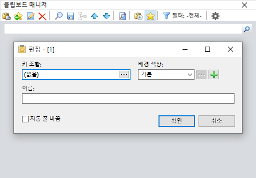

# 클립보드 관리

복사/붙여넣기 기능은 아마도 Windows 10 PC에서 가장 많이 사용되는 기능 중 하나일 것입니다.&#x20;

간단하지만 강력한 이 기능 은 속도와 효율성을 제공 하는 **Clipboard Manager 소프트웨어 를 사용**하여 더욱 향상될 수 있습니다.&#x20;

텍스트 스니펫을 찾는 데 소요되는 시간을 줄여줍니다.

텍스트나 이미지를 복사/붙여넣기 할 때마다 자동으로 클립보드에 저장됩니다. 클립보드에 저장된 이 데이터를 사용하여 추가로 붙여넣을 수 있습니다. 클립보드 관리자 도구를 사용하면 지난 며칠 동안 복사된 모든 데이터를 볼 수 있습니다. 나중에 다시 붙여넣고 싶을 때마다 이 데이터를 다시 사용할 수 있습니다.

따라서 생산성을 높이는 데 도움이 되는 Windows 효율성 향상을 위한 강력한 클립보드 관리자를 찾고 있다면 다음은 Windows 10용 최고의 클립보드 관리자에 대한 포괄적인 목록입니다.

### Comfort Clipboard (유료버전)&#x20;

[https://www.comfortsoftware.com/clipboard-manager/](https://www.comfortsoftware.com/clipboard-manager/)&#x20;

클리핑된 데이터를 항상 사용할 수 있도록 유지하려면 Comfort Clipboard가 매우 유용한 도구가 될 수 있습니다. 다른 클립보드 소프트웨어에 비해 많은 기능이 포함되어 있습니다. 자동 저장 기능은 PC를 종료하고 재부팅 후 이전 세션에서 잘린(복사된) 데이터가 필요한 상황에서 실제로 매우 유용한 많은 기능 중 하나입니다.

Lite 버전은 클립보드 기록에 저장할 수 있는 제한된 조각 세트와 함께 제공되는 두 가지 버전으로 제공됩니다. 반면에 Pro 버전에는 핫키 할당, 데이터 암호화, 텍스트 조각 편집 등과 같은 다른 편리한 옵션과 함께 끝없는 슬롯이 있습니다.

가격: 무료 평가판 사용 가능; $19.95에 업그레이드 가능

### Ditto(무료)

[https://sourceforge.net/projects/ditto-cp/](https://sourceforge.net/projects/ditto-cp/)

.png>)

Ditto는 방대한 기능 세트로 인해 목록에서 상위에 랭크된 오픈 소스 클립보드 관리자입니다.&#x20;

사용하기 쉬운 인터페이스와 함께 제공됩니다.&#x20;

클립보드에 저장된 데이터를 사용하려면 키보드의 단축키를 누르기만 하면 최근에 복사한 데이터 목록이 나타납니다.

이제 이 데이터를 복사하려면 바로 가기 키를 사용하여 바로 붙여넣기만 하면 됩니다. 메뉴를 클릭하여 최근에 사용한 데이터를 간단히 선택할 수도 있습니다. 또한 데이터를 찾을 수 없는 경우에 대비하여 Ditto는 통합 검색 기능을 제공합니다.

가격: 무료 및 오픈 소스

### ClipX (무료)

[http://bluemars.org/clipx/](http://bluemars.org/clipx/)

.png>)

시스템 트레이 아이콘을 하용하여 이전 클립보드 복원\
단축키를 사용하여 편집기에 직접 붙여넣음.

ClipX는 명령줄에 대한 간단한 인수를 사용하여 이식할 수 있는 기능이 있는 Windows용 무료 클립보드 관리자입니다. \
클립보드 목록에서 기본 및 보조 저장된 붙여넣기에 단축키를 할당할 수 있지만 특정 구문에 단축키를 할당할 수는 없습니다. \
이 소프트웨어를 사용하여 이미지와 텍스트 파일을 잘라내어 붙여넣을 수 있습니다.

ClipX는 클립보드 조회, 색상 선택기(색상 값을 클립보드에 자동으로 덤프) 및 편리하게 원하는 고정 클립보드 추가 항목을 삽입하는 플러그인과 같은 추가 기능을 제공하는 약 6개의 플러그인을 제공합니다.

### 1Clipboard

[http://1clipboard.io/](http://1clipboard.io/)

.png>)

1Clipboard는 Google 드라이브에 유연하게 통합되는 기능과 함께 제공되며 이 통합을 활성화하려면 드라이브에 액세스하려면 Google 계정에 로그인해야 합니다. 그러나 단순히 클립보드를 사용하려는 경우 단계를 떠날 수 있습니다. 드라이브가 1Clipboard에 액세스하도록 허용했음에도 불구하고 타사 애플리케이션에 부여된 권한에 대한 보안 검사를 수행하여 권한을 해제할 수 있습니다.

주요 기능으로는 구글 드라이브와의 통합, 키보드 감지를 이용한 클립보드 콘텐츠의 스마트 검색, 중요한 클립을 별표로 표시하여 쉽게 검색할 수 있도록, 구글 드라이브 사용자가 모든 주요 플랫폼에서 클립보드에 접근할 수 있는 매력적인 인터페이스 등이 있다. , 그리고 범주에서 클라우드 동기화 클립보드를 쉽게 구성할 수 있습니다.

가격: 무료

### ClipClip

[https://clipclip.com/](https://clipclip.com/) &#x20;

목록에 추가된 또 다른 훌륭한 기능은 완전히 무료이며 가벼운 소프트웨어인 ClipClip입니다. 그것을 차별화하는 것은 기존 디자인과 필요할 때 클립을 편집하고 수정할 수 있는 옵션입니다. 흥미로운 점은 다른 Windows 응용 프로그램과 비슷하다는 것입니다. 기본 창에 바로 클립을 표시하여 모든 것을 간단하게 만듭니다. 클립을 편집하려면 클립을 두 번 클릭하고 요구 사항에 따라 수정해야 합니다.

주요 기능 중에는 클립을 텍스트 형식으로 저장하는 옵션, 사용자 지정 그룹을 만드는 기능, 다른 언어의 클립을 번역하는 통합 번역기 등이 있습니다.

가격: 무료

### CopyQ (무료 및 오픈소스)

[https://hluk.github.io/CopyQ/](https://hluk.github.io/CopyQ/)&#x20;

CopyQ는 검색 및 편집 가능한 기록과 함께 제공되는 Windows 10용 또 다른 안정적인 클립보드 관리자입니다. 또한 다양한 이미지 형식, 명령줄 제어 등을 지원하는 것으로 알려져 있습니다.

많은 기능 중에는 텍스트, HTML, 이미지 및 기타 형식 저장, 트레이 메뉴 사용자 정의 기능, 새 탭에 항목 저장, 항목을 통한 빠른 탐색, 항목 정렬, 새 항목 생성, 삭제 또는 복사/붙여넣기 기능이 있습니다. 다양한 탭, 시스템 전반에 걸친 광범위한 바로 가기, 기본 창이나 트레이에서 초점이 맞춰진 창으로 즉시 붙여넣기, 완전한 사용자 지정 가능한 모양, 항목에 메모 추가 등.

가격: 무료 및 오픈 소스

